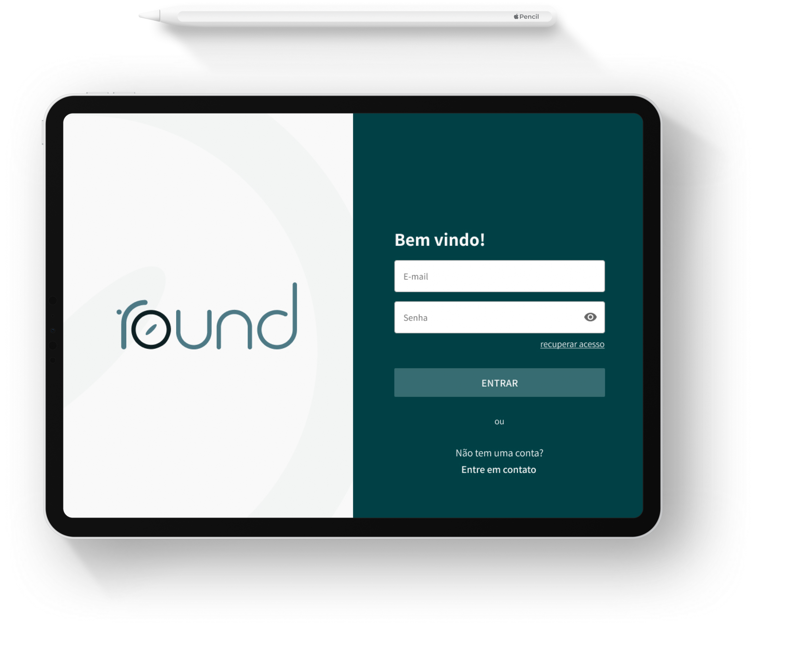

  

     
  

# Round
Trabalho de Conclusão de Curso em Design Digital - Anhembi Morumbi 2020.

  

## Sobre
O Round se trata de um aplicativo que facilitaria a comunicação entre setores de um hospital. Possibilitando o controle e a manutenção das informações por meio da inteligência artificial, que aprende com o tempo e ajuda a reduzir o desperdício de alimentos. Você pode acessá-lo em:
- [Round](https://projetoround.com/)
- [APP](https://app.projetoround.com/)

## Requisitos
* [Node.js](https://nodejs.org/en/)
* [Ambiente React Native](https://react-native.rocketseat.dev/)

## Começando
- Para iniciar o projeto é preciso primeiramente instalar o Node na sua máquina e seguir os passos para preparação do ambiente local, para isso sugiro seguir os passos no link [Ambiente React Native](https://react-native.rocketseat.dev/).
- Ao finalizar a preparação do ambiente clone o repositório para a sua máquina e inicie o projeto com `expo start --web`.

## Tecnologias
###### Mobile
* [React Native](https://reactnative.dev/).
* [Expo](https://expo.io/)

###### Web B2C
* [React](https://pt-br.reactjs.org/).
* [Next.js](https://nextjs.org/)

###### BACKEND
* [Firebase](https://firebase.google.com/)

## Padrões
###### CSS/Estilização
* [B.E.M.](http://getbem.com/)
###### Javascript
* [Airbnb Naming Javascript](https://github.com/airbnb/javascript#naming-conventions)

## Autores
* [Diego Buzanello](https://github.com/diegobuzanello)
* [Luís Otávio M. Bovo](https://github.com/luismtns)

## Licença
This project is licensed under the MIT License - see the [LICENSE.md](LICENSE.md) file for details
